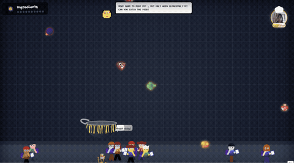
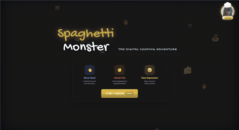
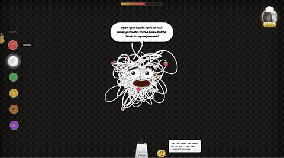
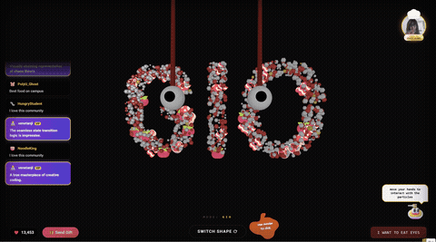
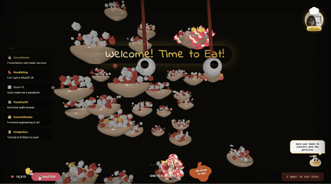
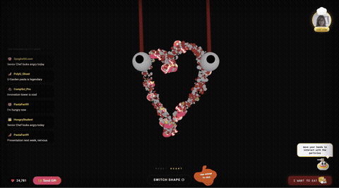
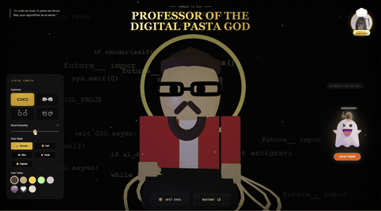

<div align="center">

# 🍝 Yummy Spaghetti Monster 🍝

### An Interactive Digital Cooking Adventure

[](https://yummyspaghettimonsteryeah.netlify.app/)
[](https://youtu.be/D6EbYgyO0Gg)
[](https://chattingwithspaghettimonster.netlify.app/)

[](https://reactjs.org/)
[](https://threejs.org/)
[](https://mediapipe.dev/)
[](https://www.typescriptlang.org/)

</div>

---

## 🎮 Play Now!

**👉 [https://yummyspaghettimonsteryeah.netlify.app/](https://yummyspaghettimonsteryeah.netlify.app/) 👈**

---

## 🎬 Full Demo Video

<div align="center">

[](https://youtu.be/D6EbYgyO0Gg)

▶️ **[Watch the complete gameplay on YouTube](https://youtu.be/D6EbYgyO0Gg)**

</div>

---

## 🎥 Demo Preview

<div align="center">


*Use hand gestures to catch ingredients and feed the Spaghetti Monster!*
</div>

---

## 📖 About

**Yummy Spaghetti Monster** is an immersive, interactive web-based game that transforms cooking into a magical digital adventure! Originally conceived as a Python concept, it has evolved into a stunning React-powered web experience featuring real-time hand tracking, face detection, and 3D particle physics.

Feed the adorable Spaghetti Monster by catching ingredients, squeezing sauce bottles with your hands, and watching the chaos unfold in beautiful particle animations!

## ✨ Features

### 🎥 **Real-Time Vision AI**
- **Hand Tracking** - Control the game using your hands via webcam
- **Gesture Recognition** - Pinch to grab, fist to catch, open hand to release
- **Face Detection** - Open your mouth to feed the monster and trigger voice bubbles

### 🎮 **Multi-Stage Gameplay**

| Stage | Description |
|-------|-------------|
| 🎬 **Opening Animation** | Cinematic story introduction |
| 🏠 **Introduction** | Learn the controls and get ready to cook |
| 🍳 **Cooking** | Catch falling ingredients with your pot using hand gestures |
| 🧴 **Feeding** | Squeeze sauce bottles and feed the Spaghetti Monster |
| 🎆 **Aftermath** | Interact with mesmerizing 3D particle formations |
| 👁️ **Transition** | Dramatic "Eat Eyes" transition sequence |
| 🗿 **Statue** | Customize the legendary GIO statue tribute |
| 💬 **Chat** | Talk to the Spaghetti Monster AI and get recipes! |

### 🎨 **Visual Experience**
- **3D Particle System** - Thousands of particles forming shapes (Heart, GIO text, Chaos, etc.)
- **Dynamic Noodle Physics** - Realistic spaghetti strand animations
- **Procedural Fire Effects** - Hand-drawn style fire animations
- **Crowd Simulation** - Detailed student characters with unique appearances

### 🔊 **Procedural Audio**
- **Dynamic BGM** - Web Audio API generated background music for each stage
- **Sound Effects** - Catch, miss, spray, explosion sounds all procedurally generated
- **No External Audio Files** - 100% programmatic audio synthesis

## 🛠️ Tech Stack

| Category | Technology |
|----------|------------|
| **Framework** | React 19.2 + TypeScript 5.8 |
| **3D Graphics** | Three.js 0.160 |
| **Vision AI** | MediaPipe Tasks Vision 0.10.14 |
| **Build Tool** | Vite 6.2 |
| **Styling** | Tailwind CSS (inline) |
| **Audio** | Web Audio API (procedural synthesis) |
| **Deployment** | Netlify |

### 🌐 Browser Compatibility

| Browser | Support | Notes |
|---------|:-------:|-------|
| Chrome | ✅ | Recommended for best performance |
| Edge | ✅ | Full support |
| Firefox | ⚠️ | WebGL may have minor issues |
| Safari | ⚠️ | MediaPipe may have limited support |
| Mobile | ❌ | Desktop only (webcam required) |

## 🚀 Run Locally

### Prerequisites
- Node.js (v18 or higher recommended)
- A webcam (for hand/face tracking features)
- Modern browser (Chrome/Edge recommended for best WebGL performance)

### Installation

```bash
# Clone the repository
git clone <repository-url>
cd copy-of-spaghetti-monster-web

# Install dependencies
npm install

# Start development server
npm run dev
```

### Build for Production

```bash
npm run build
npm run preview
```

## 🎯 How to Play - Complete Game Journey

### 🎬 Stage 1: Opening Animation

<div align="center">

</div>

> *The story begins... Watch the cinematic introduction that sets the stage for your culinary adventure!*

Allow camera access when prompted - your webcam becomes your controller!

---

### 🏠 Stage 2: Introduction

<div align="center">

</div>

Learn the controls before diving in:
- 👋 **Move Hand** → Control the pot position
- ✊ **Clench Fist** → Catch ingredients / Squeeze bottles  
- 😮 **Open Mouth** → Feed the monster & trigger sounds

Press **SPACE** or click **START COOKING** to begin!

---

### 🍳 Stage 3: Cooking - Catch the Ingredients!

<div align="center">

</div>

**Objective**: Collect 10 good ingredients to fill your pot!

| ✅ Good Ingredients | ❌ Bad Ingredients |
|:------------------:|:-----------------:|
| 🍅 Tomato | 🔋 Battery |
| 🍄 Mushroom | 💣 Bomb |
| 🥦 Broccoli | 💩 Poop |
| 🥩 Meatball | 👽 Alien |
| 🍤 Shrimp | 🤡 Meme |
| 🥓 Bacon | 🍌 Rotten Banana |

**Controls**:
- Move your hand to position the pot
- **Clench your fist** to activate catching mode
- Watch out! Bad ingredients cause screen shake and fire! 🔥

---

### 🧴 Stage 4: Feeding - Sauce the Monster!

<div align="center">

</div>

**Objective**: Fill the progress bar by spraying sauce onto the Spaghetti Monster!

**Available Sauces**:
| Sauce | Color | Emoji |
|:-----:|:-----:|:-----:|
| Tomato | 🔴 Red | 🍅 |
| Cream | ⚪ White | 🥛 |
| Pesto | 🟢 Green | 🌿 |
| Cheese | 🟡 Yellow | 🧀 |
| Gravy | 🟤 Brown | 🍖 |
| Mystery | 🟣 Purple | ✨ |

**Controls**:
- Hover over sauce buttons on the left to select
- **Pinch gesture** or **mouse click** to squeeze the bottle
- **Open your mouth** to see fun voice bubbles pop up! 💬

---

### 🎆 Stage 5: Aftermath - Particle Playground

Experience stunning 3D particle effects and interactive visual modes!

#### 🌀 Chaos Mode - Random Particle Explosion
<div align="center">

</div>

> *Thousands of particles swirling in beautiful chaos - move your hand to interact!*

---

#### ✨ GIO Mode - The Legend Spelled in Particles
<div align="center">

</div>

> *Watch the particles magically form "GIO" - a tribute to the master chef!*

---

#### 🎁 Gift Effect - Send Virtual Gifts!
<div align="center">

</div>

> *Click the Gift button to send luxurious items (Lambo, Rocket, Diamond, Mansion, Yacht) with spectacular visual effects!*

**Visual Modes** (Click "SWITCH SHAPE" to cycle):
| Mode | Description |
|:----:|:------------|
| 🌀 CHAOS | Random particle explosion |
| ⬇️ DROP | Gravity simulation with bounce |
| 🍽️ DINING | Particles form bowls of pasta |
| ❤️ HEART | Romantic heart shape |
| ✨ GIO | Spell out "GIO" in particles |

**Interactive Features**:
- 👋 Move your hand to repel particles
- ❤️ Click the heart button to send likes
- 🎁 Send virtual gifts for special effects
- 👁️ Click "I WANT TO EAT EYES" for a surprise...

---

### 👁️ Transition: "I Want to Eat Eyes!"

<div align="center">

</div>

> *Click the mysterious button and watch the dramatic transition unfold... The eyes fall, bounce, and fly towards you!*

---

### 🗿 Stage 6: Statue - Tribute to GIO

<div align="center">

</div>

**Objective**: Customize the legendary statue of Professor GIO!

**Customization Options**:
- 👓 **Eyewear**: Classic, Chic Cat-eye, Alien Slime, Hand Frames
- 💇 **Hair Style**: Normal, Full, Afro, Punk, Pigtails
- 🎨 **Hair Color**: Brown, Gold, Pink, Gradients, Patterns
- 🧔 **Beard Density**: Adjust the slider!

**Bonus**: A ghost of the Spaghetti Monster floats nearby with wisdom bubbles! 👻

---

### 💬 Bonus: Chat with the Spaghetti Monster!

<div align="center">

</div>

> *Click the "CHAT NOW" button on the Statue page to enter a whole new experience!*

**Chat Features**:
- 🗣️ Have conversations with the Spaghetti Monster AI
- 🍝 Generate authentic Italian pasta recipes
- 🤖 Powered by AI for endless culinary inspiration

**Try it now**: [Chat with Spaghetti Monster](https://chattingwithspaghettimonster.netlify.app/)

## 📁 Project Structure

```
copy-of-spaghetti-monster-web/
├── App.tsx                 # Main application & stage manager
├── index.tsx              # Entry point
├── types.ts               # TypeScript types & game constants
├── components/
│   ├── VideoIntro.tsx     # Opening video sequence
│   ├── StageIntro.tsx     # Welcome screen & controls tutorial
│   ├── StageCooking.tsx   # Ingredient catching game
│   ├── StageFeeding.tsx   # Sauce feeding mechanics
│   ├── StageAftermath.tsx # 3D particle visualization
│   ├── StageStatue.tsx    # GIO statue customization
│   └── WebcamBackground.tsx # Webcam display layer
├── utils/
│   └── audio.ts           # Procedural audio engine
└── public/                # Static assets
```

## 🎓 Credits & Acknowledgments

A creative coding project made with ❤️ at **The Hong Kong Polytechnic University**

### 👥 Team Members

<table>
<tr>
<td align="center">
<br />
<b>TheGreatRose</b> 🐱<br />
<sub>Creative Developer</sub>
</td>
<td align="center">
<br />
<b>AluOvO</b> 🐦<br />
<sub>Visual Designer</sub>
</td>
<td align="center">
<br />
<b>Root+1%</b> 1️⃣<br />
<sub>Tech Lead</sub>
</td>
</tr>
</table>

### 👨‍🏫 Special Thanks
- **Professor GIO** - The legendary Professor of Digital Pasta God, inspiration for this project
- **PolyU School of Design** - For fostering creativity and innovation

### 🛠️ Built With
- [React](https://reactjs.org/) - UI Framework
- [Three.js](https://threejs.org/) - 3D Graphics Library
- [MediaPipe](https://mediapipe.dev/) - Vision AI by Google
- [Vite](https://vitejs.dev/) - Next Generation Frontend Tooling

---

## 🐛 Known Issues & Troubleshooting

| Issue | Solution |
|-------|----------|
| Camera not working | Ensure browser has camera permission. Try Chrome/Edge. |
| Hand tracking laggy | Close other tabs. Ensure good lighting. |
| No sound | Click anywhere on the page first (browser autoplay policy). |
| 3D graphics slow | Update GPU drivers. Use Chrome with hardware acceleration. |
| GIFs not loading | Check if `public/screenshots/` folder exists with all files. |

---

## 🚧 Future Roadmap

- [ ] 📱 Mobile touch support
- [ ] 🎵 Custom music upload
- [ ] 🏆 Leaderboard system
- [ ] 🌍 Multi-language support (中文, Italiano, etc.)
- [ ] 🎨 More statue customization options
- [ ] 🤖 Enhanced AI chat with memory
- [ ] 🎮 Multiplayer mode

---

## 📄 License

This project is created for educational purposes at PolyU.

---

<div align="center">

## 🍝 Ready to Feed the Monster? 🍝

### 🎬 Watch the Full Demo

[](https://youtu.be/D6EbYgyO0Gg)

▶️ **[Complete Gameplay Video on YouTube](https://youtu.be/D6EbYgyO0Gg)**

---

### **[👉 Play Now at https://yummyspaghettimonsteryeah.netlify.app/ 👈](https://yummyspaghettimonsteryeah.netlify.app/)**

### **[💬 Chat with Spaghetti Monster AI](https://chattingwithspaghettimonster.netlify.app/)**

*"In code we trust, in pasta we thrust. May your algorithms be al dente."*

---

<table>
<tr>
<td align="center">Made with 🍝 and React</td>
<td align="center">PolyU Interactive Design Project</td>
<td align="center">2025</td>
</tr>
</table>

<sub>If you enjoyed this project, give it a ⭐ and share with your friends!</sub>

</div>
